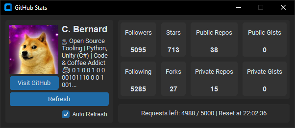

# GitHubStats

GitHub Stats is a simple desktop application that lets you quickly view a GitHub user's statistics. Built with `customtkinter`, it fetches data from the GitHub API and presents it in a clean and interactive interface.

[**Download the latest version here**](https://github.com/cfrBernard/GitHubStats/releases)

[](https://github.com/cfrBernard/GitHubStats/releases)
[](./LICENSE.md)

## Features:

- Display of the user's avatar, name, and bio.
- Detailed user statistics:
  - Followers and following count
  - Stars and forks
  - Public and private repositories
  - Public and private gists
- Manual data refresh via the **Refresh** button.
- Automatic data refresh with the **Auto Refresh** option.
- Display of remaining GitHub API requests and reset time.
- Button to directly visit the user's GitHub profile.
- Clear, responsive, and user-friendly interface with a sidebar and main panel layout.

---

<p align="center">
  
</p>

---

## 🛠 Development Setup

### Requirements:
- Python 3.11+
- Pillow for image processing
- custom tkinter for the GUI
- A personal access token from GitHub

### Installation (Dev Mode):

```
git clone https://github.com/cfrBernard/GitHubStats.git
cd GitHubStats
```
```
pip install -e .
# or
pip install -e .[dev]
```

> **Note**: Using a .venv is highly recommended.
#

### Configuration:
1. Create a `config.txt` file in the root directory.
2. Add the following lines to `config.txt`:

    ```
    GITHUB_TOKEN=your_personal_access_token
    GITHUB_USERNAME=your_github_username
    ```

---

## Dev Tools

### Run the App:

```
GHS
```

### Run pre-commit hooks:

```
pre-commit run --all-files
```

---

## 🤝 Contact:
For issues, suggestions, or contributions, feel free to open an issue on the GitHub repository.

---
> This project is licensed under the MIT [LICENSE](./LICENSE.md).
